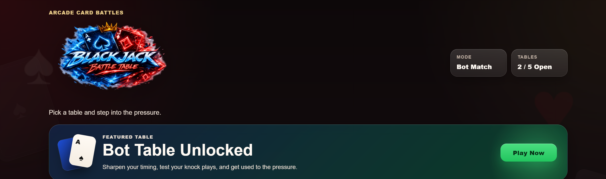
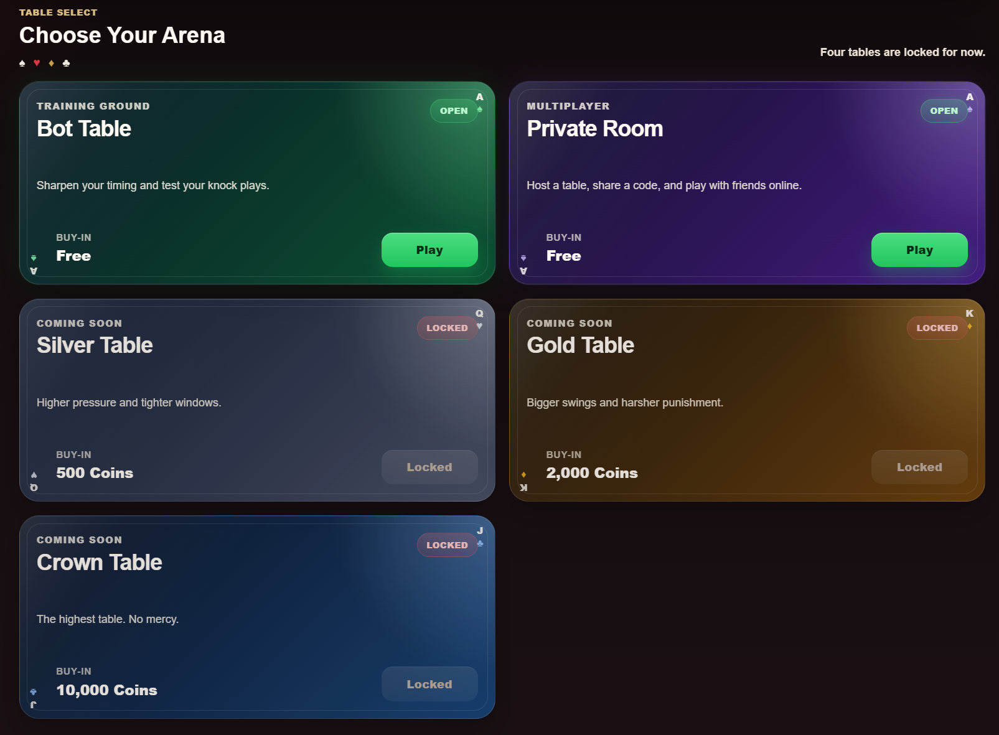

# Blackjack Game

An arcade-style browser card game with a polished table-select menu, a playable bot table, and an expanding multiplayer setup through the new **Private Table** feature.

## Live Demo

Play it here: [Blackjack Game](https://zeeshankhaled.github.io/Blackjack-Game/)

## About the Project

This project is a custom browser card game built with **HTML, CSS, and JavaScript**. It focuses on fast table-based gameplay, stylish UI, and a strong arcade feel rather than a plain card-game layout.

Right now, the project includes:
- a polished landing page and table selection screen
- a fully playable **Bot Table** mode
- a new **Private Table** page that lays the groundwork for online private-room multiplayer
- custom table themes and visual identity for each table tier

## Screenshots

### Home Screen

### Table Select

## Current Features

- **Bot Table gameplay** for practising timing, sequencing, and pressure-based play
- **Arcade-inspired menu system** with themed tables and unlock progression
- **Private Table feature** for future room-based multiplayer
- **Responsive browser-based interface** with custom visuals and table themes
- **Modular JavaScript structure** for easier expansion and future multiplayer support

## Table Modes

### Bot Table
The main playable mode right now. This is the training ground where players can learn the game flow, test strategy, and get used to the pressure of the rules.

### Private Table
A dedicated multiplayer page designed for private-room matches. The UI is already in place, and the project is being prepared for host/join room functionality.

### Future Tables
The menu also includes higher-tier tables such as Silver, Gold, and Crown, which are planned for future updates.

## Tech Stack

- **HTML5**
- **CSS3**
- **JavaScript**
- **GitHub Pages** for deployment

## Project Goal

The aim of this project is to turn a custom card-game concept into a polished browser experience with:
- strong visual identity
- fun competitive gameplay
- scalable structure for future multiplayer support

## Play Online

You can access the latest public build here:

**https://zeeshankhaled.github.io/Blackjack-Game/**
